# Results

## Implementation details

The evaluation data and images below can be reproduced using the script [evaluation.jl](./evaluation/evaluation.jl) as follows:

```
> export JULIA_NUM_THREADS=4; julia evaluation.jl <dataname>
```

This produces two figures, `<dataname>-accuracies.png` and `<dataname>-sizes.png`, and CSVs for the respective raw data.  (The first part just sets the number of theads to be used; of course, it can be left out or changed.)

Since not everything was clear or uniquely defined, I made the following choices:

- Representation of trees: the paper in its description stays close to the "strongly typed
  GP" formalism of Montana (1995).  I interpreted this more loosely and represented trees as types
  in Julia, with all operators formulated in the host language to ensure well-formedness
  (eg. random generation produces well-formed trees in Julia automatically).
- Initialization/random generation: the `RampedSplitSampler` implements the ramped-half-and-half
  sampling described in the paper by Koza (1992), with the tweak that the proportion grow and full
  sampling happens stochastically; the reason for this was to get a meaningful implementation for 
  sampling a single tree.
  
  Furthermore, the paper didn't specify the maximum depths or sizes used
  for generating the population or the mutation subtrees.  I therefore tried to choose a
  reasonable default.
- Implementation of the fitness function: this was rather difficult, since it influences the result a lot. 
  I settled for the following calculation:
  ```
  penalty = size_factor * treesize(tree) + depth_factor * treedepth(tree)
  fitness = correct - penalty
  ```
  For the factors, as shown below, I tried three different variants: both zero, 0.5 for size, and 2.0 for depth.
- Implementation of genetic operators:
    * The paper states that a "steady-state GA with elitism" had been used.  I couldn't really interpret what
      elitism signifies in this definition.  My interpretation of steady-state is to use only one population and in each
      generation, instead of generating a whole new population based on the old one, replace `popsize` times the currently 
      worst individual by an offspring (this shoud be better understandable through reading [the code](./src/gp.jl#L114)).
    * Crossover and mutation both happen with probability 0.5.  Since crossover
      only returns one individual, a random parent is chosen in the case no actual 
      mating happens.
    * Selection is stated to use tournament selection of size 7.  I therefore choose
      7 random individuals with replacement and return the best of those.

The implementation, while not very optimized, runs in reasonable time, with about 15 minutes for one evaluation (ie., 30 runs with 1000 generations), when using 4 threads.


## Outcome

The figures below (and the respective CSV data files) show 
- the average accuracy of the best individual over ten-fold crossvalidation, with 3 runs each time (ie. n = 30), and
- the size distribution of the resulting generation of all runs.

In general, we can see that the replicated test accuracies are 5 to 10 % below the ones stated in the paper, and look 
relatively consistent.  Also, the variation of penalties seems not to change much, as the authors observe, too.  The size 
distribution of the results, when using nonzero penalties, keep, except for very few outliers, within a reasonable small range, similar to the averages in the paper.

The ionosphere dataset in both cases performs much better than the others.  I strongly assume that this is due to the fact 
that it is a binary classification problem, as opposed to the 7 classes in both other data sets.

For the segmentation dataset, in the non-penalized case, we can also observe the seemingly non-converged behaviour noted by the authors.

### Glass dataset

#### Without penalties:

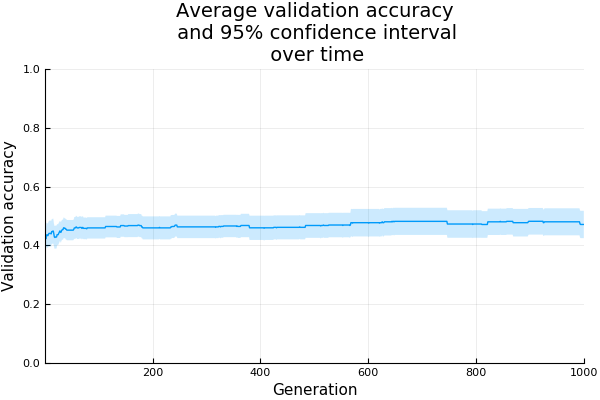

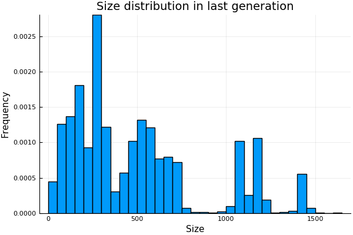

#### With size penalty factor 0.5:

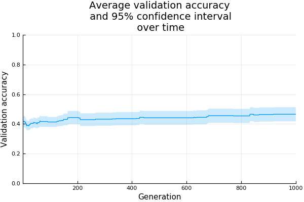
  
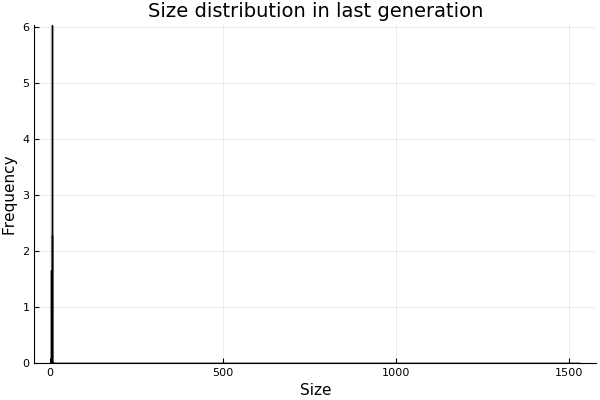
  
#### With depth penalty factor 2.0:

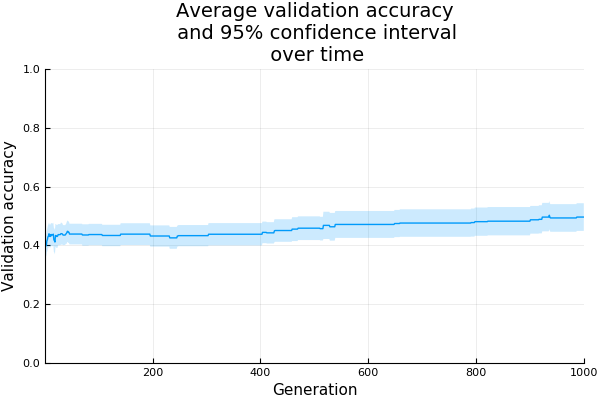
  
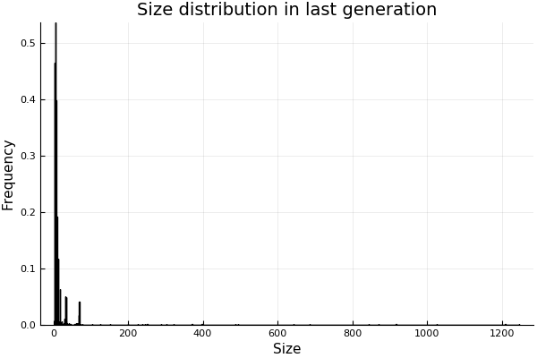

### Ionosphere dataset

#### Without penalties:

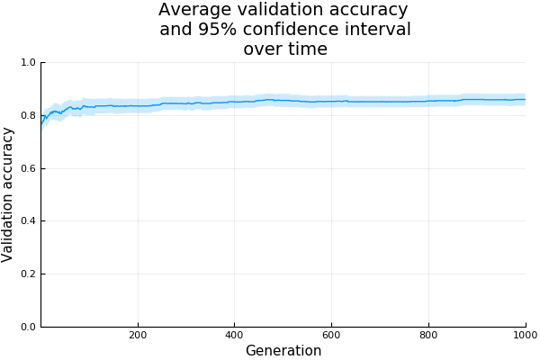

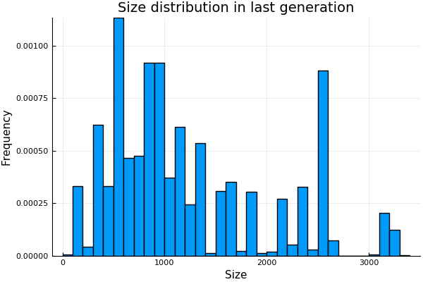

#### With size penalty factor 0.5:

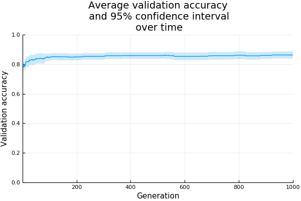
  
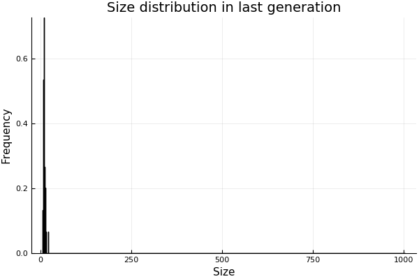
  
#### With depth penalty factor 2.0:

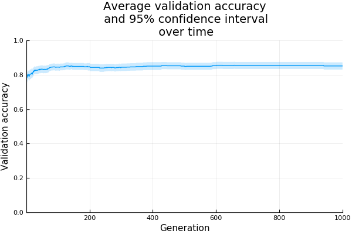
  
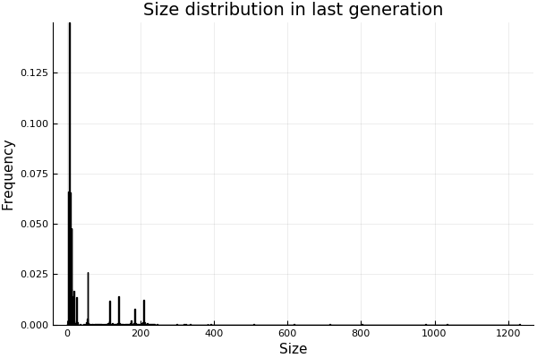

### Segmentation dataset

#### Without penalties:

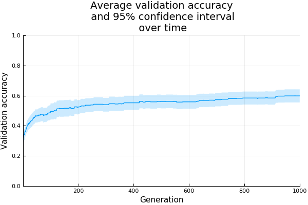

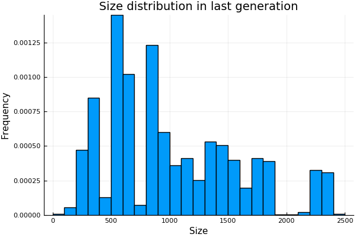

#### With size penalty factor 0.5:

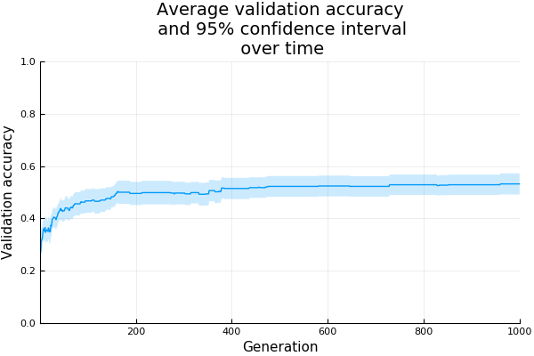
  
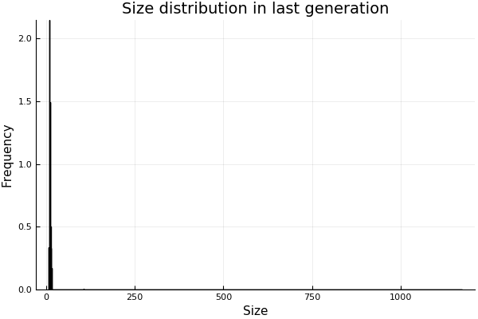
  
#### With depth penalty factor 2.0:

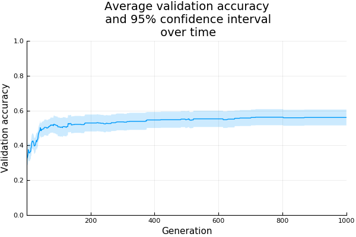
  
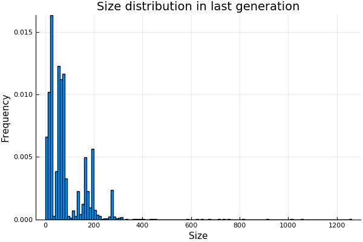
  
